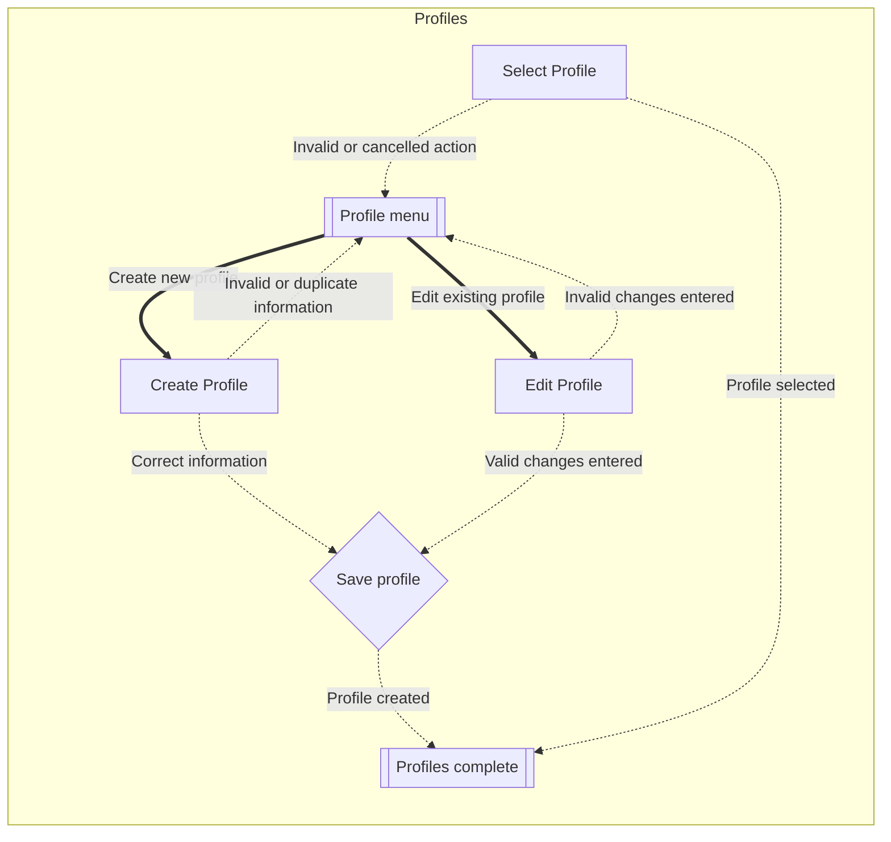
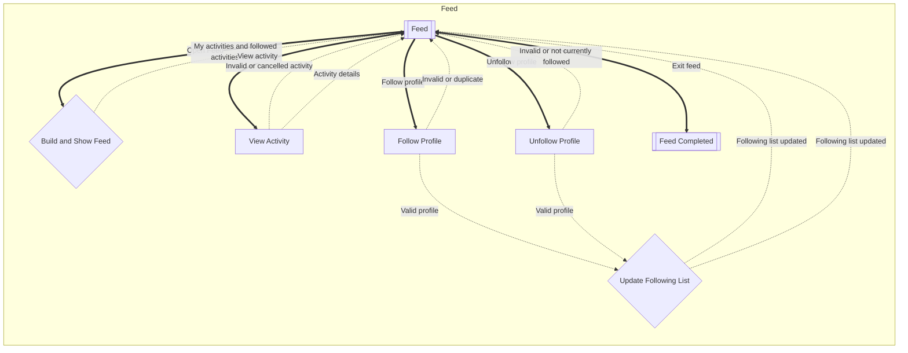
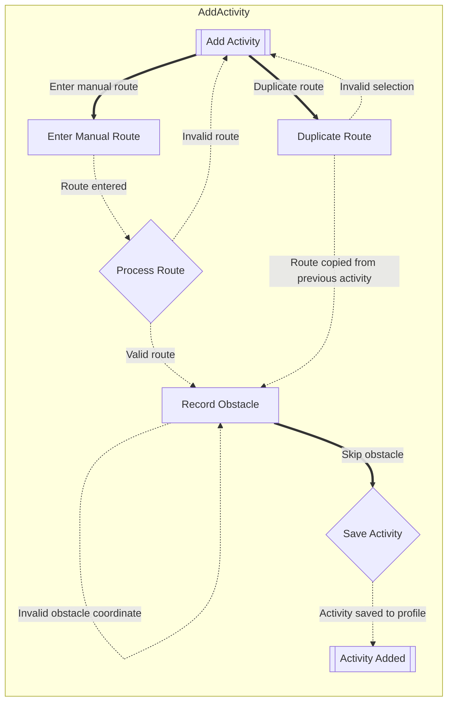
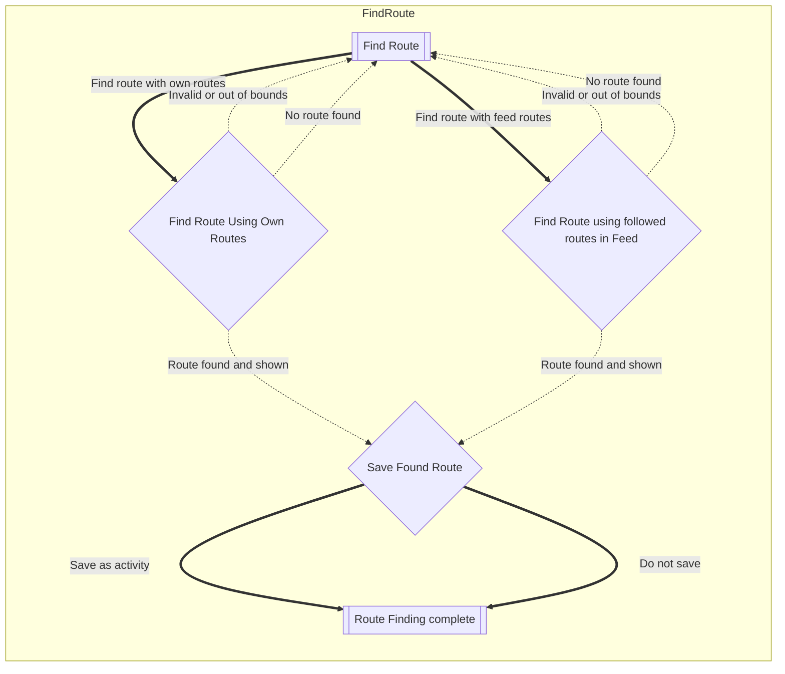

# Cyke!

This is the README for an Exercise Tracker called Cyke!

As the name suggests (hopefully), I have decided to make an exercise tracker focused on cycling because I wanted to be
different 💅

## Resources

[Colored terminal commands](https://www.geeksforgeeks.org/java/how-to-print-colored-text-in-java-console/)

## Running the program

* The functional application can be started by running the `main` method in
  `Main.java`.
* All tests can be run by running the `main` method in `TestHarness.java`
  in the test folder.

## Phase 5 Features

* Domain model was updated to new behaviours and name changes for the model classes.
* No changes were made to any Flows of Interaction.
* Implemented Test coverage.
* Implemented 4 points of persistence for the main program, it also persists worldMap and route/obstacle information
  because I wanted to learn, hopefully it didnt make the json too unreadable :(
* Implemented a fake persistence in my test folder to
  account for changes made to the main folder regarding persistence.
* The `cyke-data.json` file once created after persisting a state resides in the project root folder.
* I made some much needed UI changes that I probably should have done in Phase 4 such as listing all profiles when asked
  to select a profile or listing all obstacles (with indexes) when asking to remove an obstacle.

## Testing a stack

| method    | data                      | expected outcome                                |
|-----------|---------------------------|-------------------------------------------------|
| push()    | empty stack, push "hello" | size() = 1, isEmpty() = false, peek() = "hello" |
| push()    | stack with "A", push "B"  | peek() = "B", size() = 2                        |
| pop()     | stack with "A", "B"       | pop() = "B", size() = 1                         |
| pop()     | empty stack               | pop() throws EmptyStackException                |
| peek()    | stack with "A", "B"       | peek() = "B", size is unchanged                 |
| peek()    | empty stack               | peek() throws EmptyStackException               |
| size()    | empty stack               | size() = 0                                      |
| size()    | after push and pop        | the size() updates correctly                    |
| isEmpty() | empty stack               | returns true                                    |
| isEmpty() | after push                | returns false                                   |

## Why Zach is a bad programmer

* `BadStack1`
    * My tests indicate that `push()` does not update the stack state correctly.
    * The stack still behaves as if its empty even after pushing elements.
    * Due to `push()` failing, the other stack method related tests also seem to fail.
* `BadStack2`
    * My tests indicate that `size()` does not update correctly after removing an element.
    * `size()` after `push()` and `pop()` do not match the expected result.
* `BadStack3`
    * The stack order after `push()` is incorrect.
    * `peek()` is modifying the stack instead of just peeking.
    * `size()` returns the wrong value.
* `BadStack4`
    * `peek()` modifies the stack bruh, it shouldn't do that.
* `BadStack5`
    * It is perfect...perfect. Everything, down to the last minute details.
    * All tests passed, this is the good stack as it behaves correctly.

## Flows of Interaction(s)

### Profiles



### Feed & Follow Profiles



### Add Activity



### Find New Route



## Domain Model

```mermaid 
classDiagram

class Cyke{
    -WorldMap worldMap
    -List~Profile~ profiles
    
    +addProfile(Profile profile): void
    +getProfile(String username): Profile
    +selectProfile(String username): Profile
    +renameProfile(String oldUsername, newUsername): void
}

note for Cyke "Invariants:
    *worldMap!=null
    *profiles !=null
    *all profile usernames are unique
"

class Profile{
    -String username
    -List~ExerciseSession~ sessions
    -List~Profile~ followingList
    
    +addSession(ExerciseSession session): void
    +removeSession(int sessionID): void
    +getSession(sessionID): ExerciseSession
    +follow(Profile profile): void
    +unfollow(Profile profile): void
    +isFollowing(Profile profile): boolean
    +setUsername(String newName): void
} 
 note for Profile "Invariants:
    *username!=null and username is not empty
    *sessions !=null
    *followingList !=null
    *session IDs are unique in a profile
    *Profile cant follow itself
    *No duplicates in followingList
    "

class ExerciseSession {
  -int sessionID
  -Route route
  -int minutes
  -int calories


}

note for ExerciseSession "Invariants:
  *sessionID >=1
  *route!=null
  *route.coordinate.size >=1


"
class Route {
  -List~Coordinate~ coordinates

  +addCoordinate(Coordinate): void
  
}

note for Route "Invariants:
  *coordinates!=null
  *route is continuous:
    each next coordinate is exactly 1 step away
    horizontally OR vertically (there cant be any jumps)
  *coordinates.size()>=1
  *all coordinates are within worldMap bounds
  *route does not pass through obstacles  

"

class Coordinate {
  -int x
  -int y
}

class WorldMap{
  -int width
  -int height
  -List~Coordinate~ obstacles
    
  +isValidCoordinate(Coordinate): boolean 
  +isObstacle(Coordinate): boolean
  +addObstacle(Coordinate): void
  +removeObstacle(index): void
  
}

note for WorldMap "invariants
   
  *width>=1
  *height>=1
  *obstacles!=null;
  *obstacle coordinate is within bounds:
  0<=x<width AND 0<=y<height
"

class Stack ~Coordinate~ {
    <<interface>>
    +push(Coordinate coord ): void
    +pop() : Coordinate
    +peek(): Coordinate
    +size(): int 
    +isEmpty(): boolean
}
   
note for Stack "Preconditions / Postconditions/ Invariants:
  *push(Coordinate coord): coord != null
  *pop(): pre !isEmpty(), post size decreases by 1
  *peek(): pre !isEmpty(), post size unchanged
  *size(): result >= 0
  *isEmpty(): result == (size == 0)
"

class LinkedStack ~Coordinate~{
  -StackNode top
  -int size

  +push(Coordinate coord) void
  +pop(): Coordinate
  +peek(): Coordinate
  +size(): int
  +isEmpty(): boolean
}

note for LinkedStack "Invariants:
  *size >= 0
  *size == 0 iff top == null
  *size > 0 iff top != null
"

class StackNode ~Coordinate~{
  -Coordinate data
  -StackNode next
}

note for StackNode "Invariants:
  *data != null
"


Cyke --* WorldMap
Cyke --o Profile
Profile --* ExerciseSession
ExerciseSession --* Route
Route --* Coordinate   
WorldMap --o Coordinate


LinkedStack --* StackNode
LinkedStack ..|> Stack

