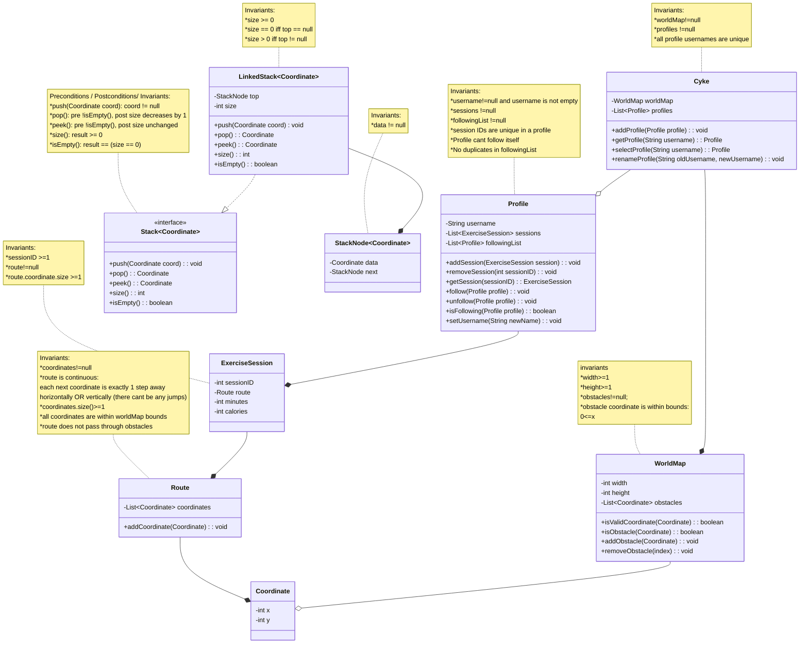
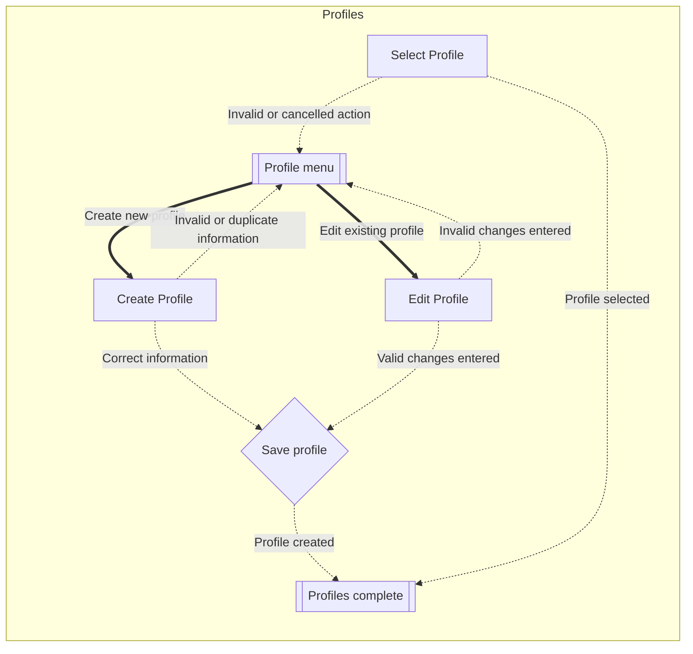
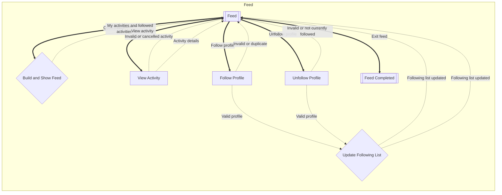
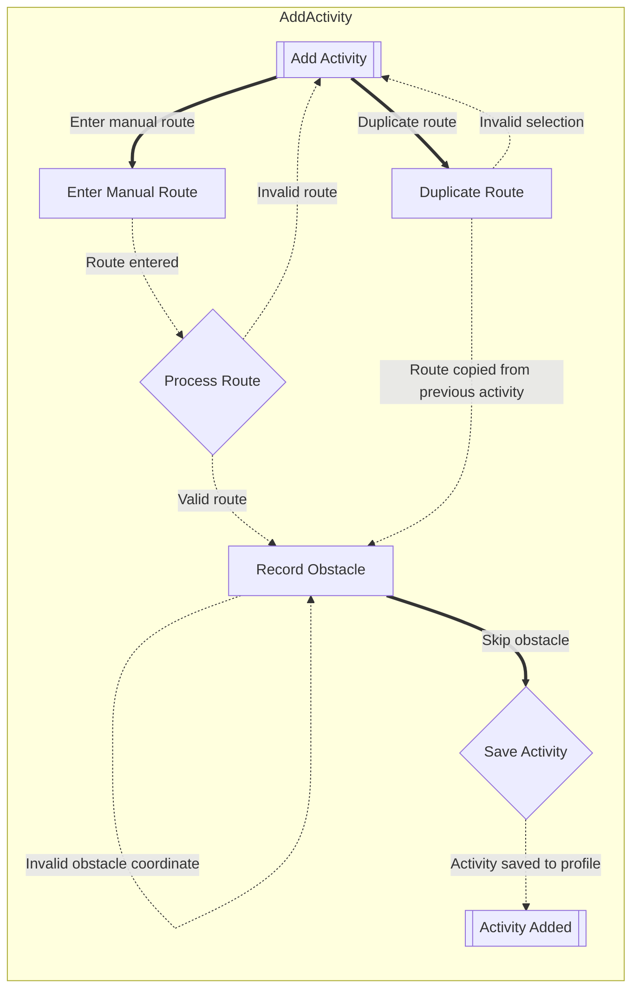
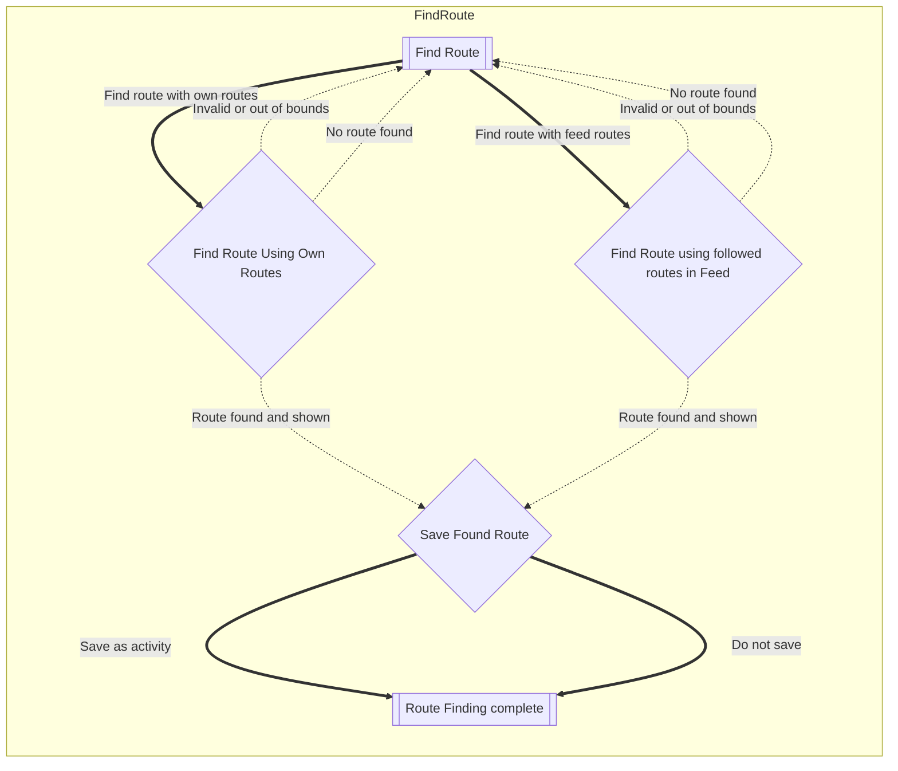

# Cyke!

This is the README for an Exercise Tracker called Cyke!

A command-line exercise tracking application focused on cycling, supporting profile management, activity tracking, route finding, and persistence.

## Running the program

* The functional application can be started by running the `main` method in
  `Main.java`.
* All tests can be run by running the `main` method in `TestHarness.java`
  in the test folder.

## Features

- Profile management (create, select, rename)
- Activity tracking with routes and statistics
- Social feed system (follow/unfollow users)
- Route finding using stack-based pathfinding
- JSON-based persistence (save/load application state)
- Modular architecture (model, logic, UI layers)
- Comprehensive automated test suite

## Domain Model

## Flows of Interaction(s)

### Profiles

### Feed & Follow Profiles

### Add Activity

### Find New Route

